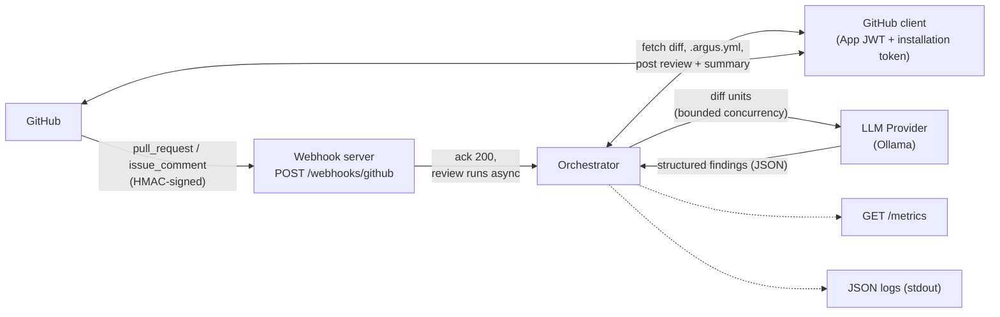

# Argus

<!-- TODO: demo GIF near here — a real PR getting an Argus review (inline
     comments + summary). This is the single highest-ROI thing in this README;
     add it once you've run Argus against a real installed GitHub App. -->

GitHub App that posts an automated first-pass code review — inline comments plus a
summary — on every pull request, using a local LLM (Ollama) by default.

[](../../actions/workflows/ci.yml)
[](../../actions/workflows/e2e-kind.yml)
[](../../actions/workflows/security.yml)

See [`PRD.md`](./PRD.md) for product scope and [`TECH_DESIGN.md`](./TECH_DESIGN.md)
for the detailed architecture.

## The problem

Pull request review is a bottleneck on most teams, and inconsistent between
reviewers even when it isn't. A lot of the feedback that does get left is
mechanical — an unchecked error, a function doing too much, an obvious injection
risk — and gets caught late because there's no second reviewer available, or the
one reviewer is busy. Argus automates that mechanical first pass so a human starts
from a diff that's already had the obvious issues flagged, instead of from zero.

## Architecture



The webhook server (`internal/webhook`) verifies `X-Hub-Signature-256` against the
App's webhook secret, then routes two triggers: a `pull_request` `opened`/
`synchronize` event, or an `issue_comment` containing `/argus review` on an open
PR. It responds `200` immediately and runs the review asynchronously so GitHub
never times out waiting on it.

The orchestrator (`internal/review`) authenticates as the GitHub App
(`internal/githubapp`, JWT → per-installation token), fetches the PR's changed
files and any `.argus.yml` on its head ref, filters ignored paths/lockfiles, and
splits the diff into reviewable units — one per file, falling back to one per hunk
for large files. Units fan out to the LLM provider (`internal/llm`, Ollama by
default) with bounded concurrency, asking for JSON-only structured findings. The
orchestrator then applies the repo's severity floor and category filter, drops
anything already posted on a prior review (identified by re-reading GitHub's own
comment listing, not a database), caps the total comment count, and posts
everything as a single GitHub review plus an upserted summary comment.

Every log line for a review is correlated by delivery ID, repo, PR number, and
head SHA (`internal/logging`); secrets are redacted before they'd ever reach a log
line, and diff/prompt content only logs at `LOG_LEVEL=debug`. `internal/metrics`
exposes review counts, findings by category, LLM errors, and a review-latency
histogram at `/metrics`.

## Quick start

Requires Go 1.26+, Docker, and a local [Ollama](https://ollama.com) install.

```bash
ollama pull qwen2.5-coder
ollama serve                     # skip if already running as a background service

cp .env.example .env
# fill in GITHUB_APP_ID / GITHUB_APP_PRIVATE_KEY / GITHUB_WEBHOOK_SECRET —
# see "See it review a real PR" below if you don't have a GitHub App yet

make up                          # builds and runs Argus via docker compose
curl localhost:8080/healthz
curl localhost:8080/metrics
```

### See it review a real PR

The webhook flow needs a live GitHub App installation and a real pull request, so
it can't be exercised end-to-end in CI or without one — this is the one part of
Quick Start you have to do against your own GitHub account:

1. Create a GitHub App (`github.com/settings/apps/new`) with permissions
   `pull_requests: write`, `contents: read`, `issues: write`, subscribed to
   `pull_request` and `issue_comment` events. Generate a private key and note the
   App ID.
2. Install the App on a throwaway test repo.
3. Expose your local server to GitHub's webhook with a tunnel, e.g.
   [smee.io](https://smee.io): create a channel, set it as the App's webhook URL,
   then run
   ```bash
   npx smee-client --url <your-smee-channel-url> --target http://localhost:8080/webhooks/github
   ```
4. `make up`, open (or push to) a PR on the test repo, and watch Argus post a
   review within about 30 seconds of the webhook arriving.

## Key design decisions & trade-offs

> TODO: this section should reflect your own reasoning, not a generated summary —
> it's the part of this doc most likely to get probed. The notes below describe
> what the code actually does; fill in *why*, over the alternatives you didn't
> take.

**Diff-chunking strategy** (`internal/review/diff.go`, `internal/llm/ollama.go`).
Argus sends one unit per changed file to the LLM, falling back to per-hunk
splitting only once a file's patch exceeds a ~4000-character budget
(`maxUnitChars`). Each hunk is rewritten so every line is prefixed with its exact
line number in the current version of the file before it reaches the prompt,
because asking a small local model to compute that number from
`@@ -a,b +c,d @@` diff arithmetic itself proved unreliable.
> TODO: why per-file-then-per-hunk rather than always-per-hunk, or a real token
> count instead of a character-count heuristic? What went wrong before you landed
> on the line-number-annotation approach?

**Inline-comment anchoring against the diff** (`internal/githubapp/client.go`,
`internal/review/orchestrator.go`). Findings are posted via GitHub's review API,
anchored to a `path` + `line` on the PR's head commit, as one `CreateReview` call
covering every finding rather than one API call per comment.
> TODO: the PRD flagged this as the riskiest integration detail to validate early —
> what did spiking it against a real PR actually surface?

**Stateless apart from GitHub itself.** Re-review dedup identifies a previously
posted finding by hashing `file+line` and reading that hash back out of GitHub's
own comment listing (`internal/review/dedup.go`) — no database and no Redis in the
request path, even though `TECH_DESIGN.md` originally sketched Redis for this.
The trade-off: the LLM's message wording (and even its severity/category pick)
isn't stable across calls for the same unchanged code, so identity deliberately
excludes it — but the model also doesn't always anchor a finding to the exact same
line across re-reviews, so a semantically identical finding can occasionally slip
past dedup as "new" a few lines away. Closing that gap needs fuzzy/semantic
matching rather than exact hashing.
> TODO: was Redis-based dedup ever actually built, or abandoned before M2? Worth
> saying so explicitly if the latter.

## Local development

```bash
make run       # go run ./cmd/service — needs GITHUB_*/OLLAMA_* env set, see .env.example
make test      # go test -race ./... — FakeProvider stands in for the LLM, no live Ollama needed
make lint      # golangci-lint run
make build     # static binary to bin/service
```

A repo controls its review via a committed `.argus.yml` on its head ref:

```yaml
min_severity: warning              # info | warning | error
categories: [bug, security]        # subset of bug, security, performance, style, maintainability
ignore: ["vendor/**", "**/*.lock"] # doublestar globs, filtered before the diff reaches the LLM
max_files: 25
max_comments: 15
persona: "concise senior engineer"
```

Any field left out keeps its default (`internal/repoconfig`); a missing or
malformed file falls back to defaults entirely, logged but not fatal.

## Deploy to kind

kind runs every cluster node as a Docker container and does **not** share the host
Docker daemon — a locally built image has to be explicitly loaded into the
cluster, and that step is required after every rebuild, not just the first one.

```bash
kind create cluster --name argus-dev

docker build -t argus:latest .
kind load docker-image argus:latest --name argus-dev

cp k8s/secret.example.yaml k8s/secret.yaml   # fill in real values; git-ignored
kubectl apply -f k8s/secret.yaml
kubectl apply -k k8s/
kubectl rollout status deployment/argus

kubectl port-forward svc/argus 8080:8080 &
curl localhost:8080/healthz
curl localhost:8080/metrics
```

After any code change:

```bash
docker build -t argus:latest .
kind load docker-image argus:latest --name argus-dev
kubectl rollout restart deployment/argus
```

Non-secret config (`OLLAMA_BASE_URL`, `OLLAMA_MODEL`, `LOG_LEVEL`) comes from the
`argus-config` ConfigMap (`k8s/configmap.yaml`); `OLLAMA_BASE_URL` defaults to
`http://host.docker.internal:11434` so the pod reaches a host-run `ollama serve`.
This exact flow runs in CI on every PR (`.github/workflows/e2e-kind.yml`).

## License

MIT — see [LICENSE](./LICENSE).
