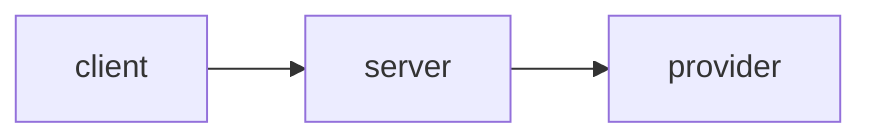

# <service-name>

> One-line description. Built from the **go-service-template** (used by Argus & Heimdall).

[](../../actions/workflows/ci.yml)
[](../../actions/workflows/security.yml)

## What it does
A short paragraph. Link the design docs: [`PRD.md`](./PRD.md) · [`TECH_DESIGN.md`](./TECH_DESIGN.md).

## Architecture
<!-- Drop an architecture diagram here (excalidraw/mermaid export). Recruiters read this first. -->



## Quick start (local)
```bash
make up        # docker compose: service + postgres + redis
curl localhost:8080/healthz
make test
```

## Develop
```bash
make run       # run the server (needs deps up)
make test      # go test -race ./...
make lint      # golangci-lint
make build     # compile binary
```

## Deploy to minikube
```bash
minikube start
eval "$(minikube docker-env)"      # build into minikube's docker
docker build -t service:latest .
kubectl apply -k k8s/
kubectl port-forward svc/service 8080:8080
```

## Demo
<!-- Add a GIF of the thing working. This is the single highest-ROI thing in the README. -->

## License
MIT — see [LICENSE](./LICENSE).
