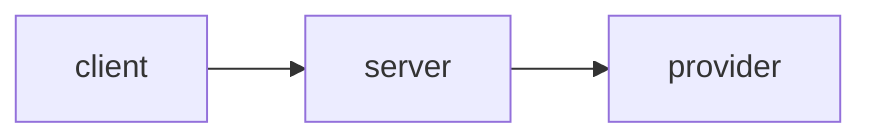

# <service-name>

> One-line description. Built from the **go-service-template** (used by Argus & Heimdall).

[](../../actions/workflows/ci.yml)
[](../../actions/workflows/security.yml)

## What it does
A short paragraph. Link the design docs: [`PRD.md`](./PRD.md) · [`TECH_DESIGN.md`](./TECH_DESIGN.md).

## Architecture
<!-- Drop an architecture diagram here (excalidraw/mermaid export). Recruiters read this first. -->



## Quick start (local)
```bash
make up        # docker compose: service + postgres + redis
curl localhost:8080/healthz
make test
```

## Webhook (M1)
`POST /webhooks/github` verifies the `X-Hub-Signature-256` header against `GITHUB_WEBHOOK_SECRET`,
authenticates as the GitHub App (`GITHUB_APP_ID` + `GITHUB_APP_PRIVATE_KEY`), and on
`pull_request: opened`/`synchronize` fetches the PR's diff, sends it to a local Ollama model
(`OLLAMA_BASE_URL`, `OLLAMA_MODEL`; defaults to `http://localhost:11434` / `qwen2.5-coder`) for
structured findings, and posts them as inline review comments plus a summary comment. Copy
`.env.example` to `.env` (git-ignored) for local dev; in CI/k8s these come from Secrets, never from
a committed file.

## Config & re-review (M2)
A repo can commit a `.argus.yml` on the PR's head ref to control the review:
```yaml
min_severity: warning              # info | warning | error
categories: [bug, security]        # subset of bug, security, performance, style, maintainability
ignore: ["vendor/**", "**/*.lock"] # doublestar globs, filtered before the diff is sent to the LLM
max_files: 25
max_comments: 15
persona: "concise senior engineer"
```
Any field left out keeps its default; a missing or malformed file falls back to defaults
entirely (logged, not fatal). On re-review (a new commit, or a `/argus review` comment on the
PR), Argus skips any finding it already posted for unchanged code — identity is a hash of
file+line+message embedded as a marker in each comment, read back from GitHub's own comment
listing, so no database is involved.

## Develop
```bash
make run       # run the server (needs deps up)
make test      # go test -race ./...
make lint      # golangci-lint
make build     # compile binary
```

## Deploy to minikube
```bash
minikube start
eval "$(minikube docker-env)"      # build into minikube's docker
docker build -t argus:latest .
cp k8s/secret.example.yaml k8s/secret.yaml   # fill in real values, git-ignored
kubectl apply -f k8s/secret.yaml
kubectl apply -k k8s/
kubectl port-forward svc/argus 8080:8080
```

## Demo
<!-- Add a GIF of the thing working. This is the single highest-ROI thing in the README. -->

## License
MIT — see [LICENSE](./LICENSE).
